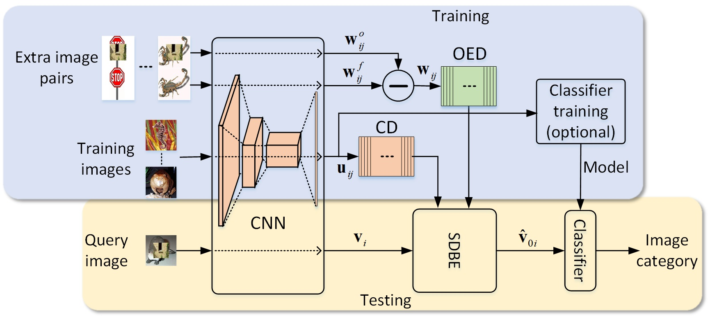
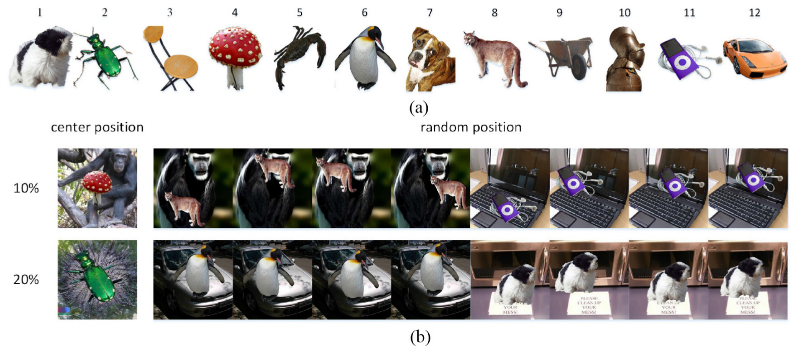

# Boosting Occluded Image Classification via Subspace Decomposition Based Estimation of Deep Features

## Table of Contents

1. [Introduction](#1-introduction)
1. [Main results](#2-main-results)
1. [Environment setup](#3-environment-setup)
1. [Demos](#4-demos)
1. [Citation](#5-citation)
##   1. Introduction
Occlusion occurs in many real-world images. For the human vision system, recognizing partially occluded objects is not a tough mission. In the computer vision domain, however, this is still a highly challenging task even for the cutting-edge deep learning technologies. For the classification of occluded images, training the state-of-the-art CNNs usually requires a large number of occluded images to cover the variations caused by occlusion. Collecting  sufficient occluded images is, however, difficult in real applications.

To achieve a robust image classification for occluded images, we propose a novel scheme using the subspace decomposition-based estimation (SDBE). 

 

Fig. 1 Flowchart of the proposed SDBE-based classification scheme. The proposed SDBE is inserted into the processing chain of classification between the base CNN and the classifier as a post-processing procedure for the DFVs.

The SDBE-based classification scheme employs a base CNN to extract the deep feature vector (DFV), and then utilizes the SDBE to compute the DFV of the original occlusion-free image for classification. The SDBE is performed by projecting the DFV of the occluded image onto the linear span of a class dictionary (CD) along the linear span of an occlusion error dictionary (OED). The CD and OED are constructed, respectively, by concatenating the DFVs of a training set and the occlusion error vectors of an extra set of image pairs. Two implementations of the SDBE are studied: 1) the $l_1$-norm and 2) the squared $l_2$-norm regularized least-squares estimates. 

##  2. Main results

Extensive experimental results demonstrate that the proposed SDBE-based scheme dramatically boosts the classification accuracy for occluded images, and achieves over 20% increase in classification accuracy under 20% occlusion on the ILSVRC2012 classification dataset.

 Fig. 2 Examples of the occlusion patches and occluded query images used in the SDBE_L2 experiment on the large-scale occluded image dataset that is synthesized from ILSVRC 2012 classification dataset. (a) Occlusion patches. (b) Examples of the occluded query images. 

Table 1. Comparison of classification accuracy for the conventional scheme and the SDBE_L2 scheme on the large-scale occluded image dataset that is synthesized from the ILSVRC 2012 classification dataset. Experiment was conducted on the full validation set.

| Occlusion ratio |       Method        | Classification accuracy | Improvement |
| :-------------: | :-----------------: | :---------------------: | :---------: |
|       0%        | original ResNet-152 |         75.39%          |             |
|                 |       SDBE_L2       |         74.82%          |   -0.57%    |
|       10%       | original ResNet-152 |         49.22%          |             |
|                 |       SDBE_L2       |         61.77%          |   12.55%    |
|       20%       | original ResNet-152 |         26.91%          |             |
|                 |       SDBE_L2       |         48.71%          |    21.8%    |

##  3. Environment setup 

- #### Install MatConvNet
  Download [MatConvNet](https://github.com/vlfeat/matconvnet/tree/v1.0-beta24) and unzip it to `src/matconvnet/`.

  Follow the [instruction](https://www.vlfeat.org/matconvnet/install/#compiling) to compile MatConvNet.

- #### Download pre-trained model
  Download [pre-trained MatConvNet ResNet152 model](https://www.vlfeat.org/matconvnet/models/imagenet-resnet-152-dag.mat) to `src/cnn_models`.

> **_NOTE:_**  If you have a GPU, you can run `src/install_matconvnet.m` script in MATLAB to install the MatConvNet and download the pre-trained model.
>
> **_TIPS:_** It is useful to use a more recent version of CUDA than the one officially supported by MATLAB. For MATLAB 2016b on Ubuntu16.04, to compile the MatConvNet package, please change g++ and gcc to 4.9.3 version by using `sudo update-alternatives --config g++` and `sudo update-alternatives --config gcc`.

- #### Install linear SVM package
Download and unzip [LIBLINEAR](https://www.csie.ntu.edu.tw/~cjlin/liblinear/) to `src/liblinear/`, and then follow the instruction in `src/liblinear/matlab/README` to compile the MATLAB interface of LIBLINEAR.
> **_NOTE:_** Alternatively, you can run `src/install_liblinear.m` script in MATLAB to install the package. 

## 4. Demos

The code is verified on Ubuntu 16.04 with MATLAB 2016b and CUDA 8.0. 

### 4.1 Caltech 101

- #### Download and prepare training images, extra images, and test images

  Run `datasets/caltech101/data_prepare.m` script in MATLAB.

- #### Evaluation
  ##### SDBE_L1 demo
  Run `src/SDBE_L1_caltech101_demo.m` script in MATLAB. 
  ##### SDBE_L2 demo
Run `src/SDBE_L2_caltech101_demo.m` script in MATLAB.
  

> **_NOTE:_**  If you do not have a GPU or the size of GPU memory is smaller than 4GB, please  set "USEGPU = false" in these two scripts.

### 4.2 ILSVRC2012
- #### Download and prepare ILSVRC2012 dataset
  Refer to https://jkjung-avt.github.io/ilsvrc2012-in-digits/  for downloading the ILSVRC 2012 classification dataset to the folder `datasets/ilsvrc2012/` and having the train/val images organized to the following folder structure in `datasets/ilsvrc2012/`
  ```
  train/
  ├── n01440764
  │   ├── n01440764_10026.JPEG
  │   ├── n01440764_10027.JPEG
  │   ├── ......
  ├── ......
  val/
  ├── n01440764
  │   ├── ILSVRC2012_val_00000293.JPEG
  │   ├── ILSVRC2012_val_00002138.JPEG
  │   ├── ......
  ├── ......
  ```

  Alternatively, on Linux you can
  1. Download `ILSVRC2012_img_train.tar` and `ILSVRC2012_img_val.tar` to `datasets/ilsvrc2012/`.
  2. `$ cd datasets/ilsvrc2012/`
  3. `$ bash ilsvrc_prepare.sh`
- #### Prepare training images, extra images, and test images
  Run `datasets/ilsvrc2012/data_prepare.m` script in MATLAB.  
  By default, the script uses a subset of the validation set, where each class contains 5 images, to synthesize the occluded test images.  If you intend to evaluate on the full validation set, you need to set `FULLVALSET=true` and convert the ILSVRC2012 validation images that are encoded in CMYK jpeg format to RGB jpeg format in advance because `imread` function is unable to handle CMYK jpeg.

- #### Evaluation
  Run `src/SDBE_L2_ILSVRC2012_demo.m` script in MATLAB. If you do not have a GPU or the size of GPU memory is smaller than 4GB, you need to set `USEGPU=false` in the script.

- #### Result
  The result on the subset of the validation set is shown as follows.

| Occlusion ratio |       Method        | Classification accuracy |
| :-------------: | :-----------------: | :---------------------: |
|       0%        | original ResNet-152 |         75.73%          |
|                 |       SDBE_L2       |         75.29%          |
|       10%       | original ResNet-152 |         49.25%          |
|                 |       SDBE_L2       |         61.87%          |
|       20%       | original ResNet-152 |         26.92%          |
|                 |       SDBE_L2       |         48.70%          |

## 5. Citation

If you feel our code helps in your research, please kindly cite our papers:
```
@ARTICLE{8794588,  
author={F. {Cen} and G. {Wang}},  
journal={IEEE Transactions on Cybernetics},   
title={Boosting Occluded Image Classification via Subspace Decomposition-Based Estimation of Deep Features},   
year={2020},  
volume={50},  
number={7},  
pages={3409-3422},}
```

